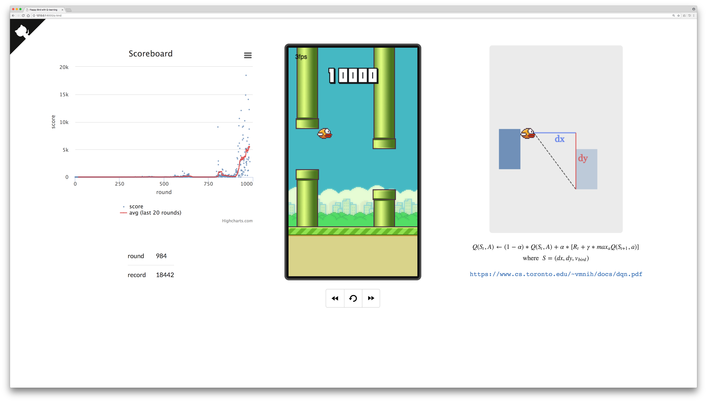
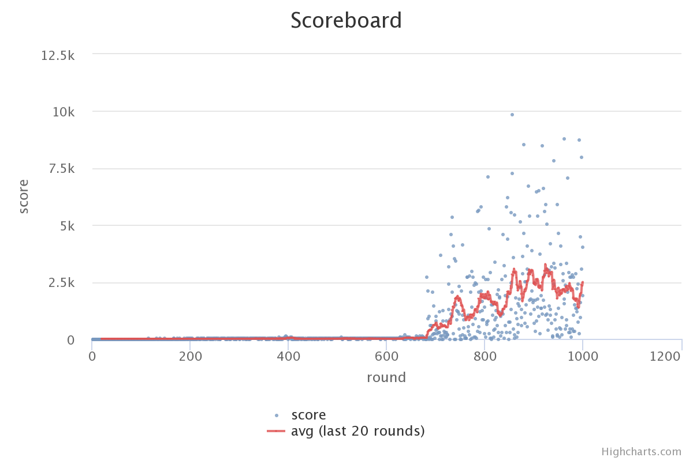
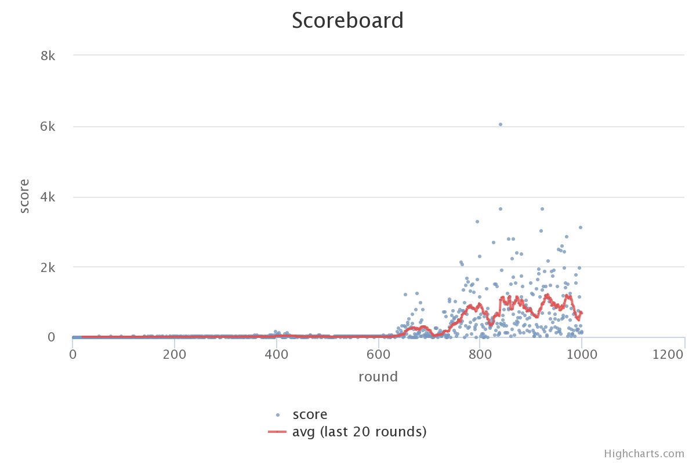
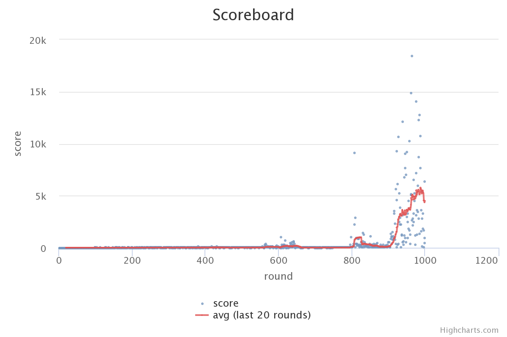
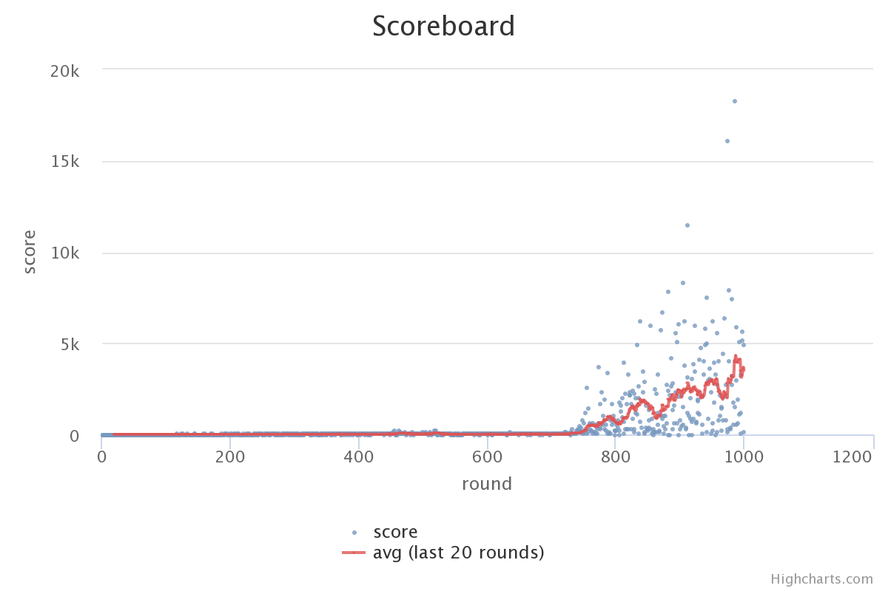

## Flappy Bird with Q-Learning
A simple implementation to [Playing Atari with Deep Reinforcement Learning](https://www.cs.toronto.edu/~vmnih/docs/dqn.pdf).


Train the bird online at [https://w3ntao.github.io/q-bird](https://w3ntao.github.io/q-bird).\
Train the bird locally:
1. host a server with python: `$ python3 -m http.server 8000`
2. type http://0.0.0.0:8000 in a browser to play



### Pseudocode
```
Q ← {}
state-seq ← []

for each round:
    for each frame:
        S ← current state
        if S in Q:
            if Q(S, flap) > Q(S, do-nothing):
                A ← flap
            else:
                A ← do-nothing
        state-seq ← state-seq + [S, A]

        if termination:
            for [S, A] in reversed(state-seq):
                if S is the 1st (right before termination):
                    Q(S, A) ← (1 - α) * Q(S, A) + α * R
                else:
                    S' ← next state of S
                    Q(S, A) ← (1 - α) * Q(S, A) + α * {R + γ * max[Q(S', flap), Q(S', do-nothing)]}
            state-seq ← []

α: learning rate
γ: discount factor
R: reward
       +1 for survival
    -1000 for death
```

### After 1000 Rounds' Iteration
 

 

### Credits
[https://github.com/enhuiz/flappybird-ql](https://github.com/enhuiz/flappybird-ql)\
[https://github.com/chncyhn/flappybird-qlearning-bot](https://github.com/chncyhn/flappybird-qlearning-bot)
